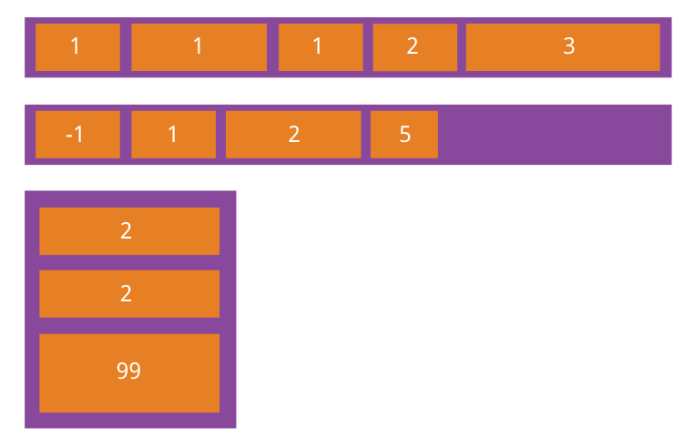

# git 用法  
	git clone URL
	cd XX_Name
	git branch dev
	git checkout dev
	git add .
	git commit -m "备注"
	git push origin dev

___
	git status
	git pull
	git log
	.......指令
___
##Git 补充

###创建分支并使用的步骤：
    1. 在git官网进行新分支的创建（或者也可通过git bash内 使用git brach dev1 命令）  
    2. git pull (将最新代码从git仓库下拿下来 或者也可在空目录下使用git clone url)  
    3. git checkout dev1 (切换到新建的dev1分支，因为pull或者clone下来默认在master主分支上)
    4. npm run start 启动服务器

###每次更改代码后提交的操作：（如：此次更改基于dev1号分支）    
    1. git status  
    2. git add .  
    3. git commit -m "备注"  
    4. git push
    5. git checkout master 切换回主分支master  
    6. git merge dev1 在主分支下合并dev1支


---

# Element UI
	标签的引入
	npm i element-ui -S  

	import ElementUI from 'element-ui'
	import 'element-ui/lib/theme-chalk/index.css'
	Vue.use(ElementUI)
___		
# Vue cli2 脚手架的生成  
	npm install -g vue-cli  
    vue init webpack project  
___

### Vue cli2 两处修改
    1. config/index.js  
        build:assetsPublicPath: '/' ----> build:assetsPublicPath: './'  
    2.（npm run build 遇到版本错误） node_modules semver test--->return true
___
### Vue router 基础学习 --基于cli
* 基础   
	>两个标签的使用  
	>router-link  
	>router-view

* 起步  
	>
* 动态路由匹配  
```html
<!--    <router-link to="/p1/page11">Go to Page11</router-link>-->
<!--    <router-link to="/p1/page12">Go to Page12</router-link>-->
    <router-link :to="{name:'page11'}">Go to Page11</router-link>
    <router-link :to="{name:'page12'}">Go to Page12</router-link>
```
* 嵌套路由  

```
 {
  path: '/p2',
  name: 'p2',
  component: page2,
  children: [
    {
      // 当 /user/:id/profile 匹配成功，
      // UserProfile 会被渲染在 User 的 <router-view> 中
      path: 'page21',
      name: 'page21',
      component: page21
    },
    {
      // 当 /user/:id/posts 匹配成功
      // UserPosts 会被渲染在 User 的 <router-view> 中
      path: 'page22',
      name: 'page22',
      component: page22
    }
  ]
}
```
* 编程式的导航  
```html
// this.$router.push({path: subroute})
   this.$router.push({name: subroute})
```
* 命名路由  
    >见上 通过name属性进行路由跳转

### vue-cli中配置sass
##### 1.安装对应依赖node模块：
    >npm install node-sass --save-dev  
        npm install sass-loader --save-dev  
##### 2.打开webpack.base.config.js在loaders里面加上
```
{
     test: /\.scss$/,
     loaders: ["style", "css", "sass"]
},
```
##### 3.在用scss的地方写上
`<style lang="scss" scoped="" type="text/css"></style>`

### Vue 冒号与不加冒号
>加冒号的，说明后面的是一个变量或者表达式；  
没加冒号的后面就是对应的字符串字面量！
___
### web前端开发技术规范
1. HTML

2. CSS

3. JS
___
### null、undefined与NaN
undefined表示"缺少值"
>（1）变量被声明了，但没有赋值时，就等于undefined。  
（2) 调用函数时，应该提供的参数没有提供，该参数等于undefined。  
（3）对象没有赋值的属性，该属性的值为undefined。  
（4）函数没有返回值时，默认返回undefined。  

null
>
NaN
>
___
### typeof、instanceof、Object.prototype.toString
####1.typeof  返回一个变量的基本类型，用来检测值类型的数据类型
>number,boolean,string,object,undefined,function
alert(typeof 1) //number  
alert(typeof "1") //string  
alert(typeof []) //object  
alert(typeof null) //object  
alert(typeof a) //undefined  
alert(typeof false) //boolean

####2.instanceof  返回的是一个布尔值，用来判断对象和函数，不能用来判断字符串和数字等
>var a={};  
 alert(a instanceof Object);  //true  
 var b=[];  
 alert(b instanceof Array);  //true  
 alert("string" instanceof String);  //false  
 alert(new String("string")instanceof String);  //true  
####3、Object.prototype.toString.call() 用来精确判断对象的类型
>alert(Object.prototype.toString.call([])) // "[object Array]"  
 Object.prototype.toString.call({}) //"[object Object]"  
 Object.prototype.toString.call(new Date()) //"[object Date]"  

___
# SASS
    Sass 是成熟、稳定、强大的 CSS 扩展语言。  
    This helps avoid repetition of parent selectors, and makes complex CSS layouts with lots of nested selectors much simpler. 
#### 1.变量
>SASS通过$符号去声明一个变量
#### 2.嵌套
>SASS允许开发人员以嵌套的方式使用CSS，但是过度的使用嵌套会让产生的CSS难以维护，因此是一种不好的实践  
#### 3.引入
>CSS原生的@import会通过额外的HTTP请求获取引入的样式片段.  
而SASS的@import则会直接将这些引入的片段合并至当前CSS文件，并且不会产生新的HTTP请求。
#### 4.混合
>混合（Mixin）用来分组那些需要在页面中复用的CSS声明，开发人员可以通过向Mixin传递变量参数来让代码更加灵活，该特性在添加浏览器兼容性前缀的时候非常有用，SASS目前使用@mixin name指令来进行混合操作。  
```html
@mixin border-radius($radius) {
          border-radius: $radius;
      -ms-border-radius: $radius;
     -moz-border-radius: $radius;
  -webkit-border-radius: $radius;
}

.box {
  @include border-radius(10px);
}
```
>上面的代码建立了一个名为border-radius的Mixin，并传递了一个变量$radius作为参数，然后在后续代码中通过@include border-radius(10px)使用该Mixin，最终编译的结果如下：  
```
.box {
  border-radius: 10px;
  -ms-border-radius: 10px;
  -moz-border-radius: 10px;
  -webkit-border-radius: 10px; }
  ```
#### 5.继承
```html
// 下面代码会正常输出到生成的CSS文件，因为它被其接下来的代码所继承。
%message-common {
  border: 1px solid #ccc;
  padding: 10px;
  color: #333;
}

.message {
  @extend %message-common;
}

.success {
  @extend %message-common;
  border-color: green;
}
```
#### 6.操作符
SASS提供了标准的算术运算符，例如+、-、*、/、%  

#### 7.引用父级选择器"&"
>无论CSS规则嵌套的深度怎样，关键字"&"都会使用父级选择器级联替换全部其出现的位置：
```
/*===== SCSS =====*/
#main {
  color: black;
  a {
    font-weight: bold;
    &:hover { color: red; }
  }
}

/*===== CSS =====*/
#main {
  color: black; }
  #main a {
    font-weight: bold; }
    #main a:hover {
      color: red; }
```
#### 8.嵌套属性
>CSS许多属性都位于相同的命名空间（例如font-family、font-size、font-weight都位于font命名空间下），Scss当中只需要编写命名空间一次，后续嵌套的子属性都将会位于该命名空间之下，请看下面的代码：
```html
/*===== SCSS =====*/
.demo {
  // 命令空间后带有冒号:
  font: {
    family: fantasy;
    size: 30em;
    weight: bold;
  }
}

/*===== CSS =====*/
.demo {
  font-family: fantasy;
  font-size: 30em;
  font-weight: bold; }
```  
___
# CSS3  background-size : cover与contain的区别s
    background-size中的cover与contain都是将图片以相同的宽高比缩放以适应容易的宽高。  
    不同的是`cover`会缩放至图片能够铺满整个容器，可能会有部分图片区域被裁剪。  
    `contain`则是图片会缩放至整个图片都能显示完全，但是容易可能会有留白。


___
#跨域
###为什么会产生跨域
    为了安全, 提出了同源策略  
####源
    • 源（origin）就是协议、域名和端口号  
        http://www.test.com:8080  
        若地址里面的协议、域名和端口号均相同则属于同源。
    以下是相对于 http://www.a.com/test/index.html 的同源检测  
    • http://www.a.com/dir/page.html ----成功  
    • http://www.child.a.com/test/index.html ----失败，域名不同  
    • https://www.a.com/test/index.html ----失败，协议不同  
    • http://www.a.com:8080/test/index.html ----失败，端口号不同
    
    什么是同源策略？ 
        同源策略是浏览器的一个安全功能，不同源的客户端脚本在没有明确授权的情况下，不能读写对方资源。  
        所以a.com下的js脚本采用ajax读取b.com里面的文件数据是会报错的。

####跨域
    不是同源的脚本不能操作其他源下面的对象。想要操作另一个源下的对象是就需要跨域。

#####解决跨域问题
    一、允许浏览器跨域  
    二、保证协议、域名、端口一致  （同源）
    三、服务层解决、前端解决  
        1、JSONP  
        2、服务层  
        3、Nginx解决  
        4、Vue解决  

___

#学习笔记：
1. 组件中如果对window绑定事件，在deactive或者unmounted中要对事件进行解绑，否则会影响其他页面。

2. 组件A中嵌套使用组件A的使用方法（递归组件）：不用再次import组件，通过name属性进行调用。
3. keepalive 缓存 可以除去其中的某个跳转 （exclude）
    ```
    <keep-alive exclude="Detail">
          <router-view/>
        </keep-alive>
    ```
4. router index.js  
    ```
    scrollBehavior (to, from, savedPosition) {
        return { x: 0, y: 0 }
      }
    ```
    页面切换时始终回到top最顶部   
5. 动画渐变插件  
     >使用slot放入内容
    ```
    <template>
      <transition>
        <slot></slot>
      </transition>
    </template>
    
    <script>
    export default {
      name: 'FadeAnimation'
    }
    </script>
    
    <style lang="stylus" scoped>
      .v-enter, .v-leave-to
        opacity: 0
      .v-enter-active, .v-leave-active
        transition: opacity .5s
    </style>
    
    ```

6. 阻止事件默认行为，.prevent .stop ....
  
7. 异步组件加载  
    router.js中修改/或者加载正常vue组件时也可使用这种方法将同步请求改成异步请求
      
        >同步加载：    --->一次性加载所有组件
    ```
    import Home from '@/pages/home/Home'  
    
    component: Home
    ```    
        >异步加载：(better) 按需加载--->用到什么组件，才加载什么组件  -->但是每次都会发起一次http请求
    ```
    component: ()=>import('@/pages/home/Home')
    ```
    是否使用同步or异步，需要看情况而定，当项目很庞大，app.js很大时，使用异步加载。其他情况，同步加载即可。  
8. Better-scroll插件   
9. fastclick 插件  （移动端插件）
10. vue-awesome-swiper插件  swiper插件 （轮播插件）
11. iconfont的使用方法  （字体图标）

---

#Webpack 前端工程化
1. 模块化  注意暴露与引用模块的方法
>服务器端：commonjs  同步执行  
浏览器端：  
    AMD（RequireJS） 提前执行  
    CMD（SeaJS）懒执行  
    UMD 通用解决方案  判断上述集中模块化方法是否支持  
    ESModule  
    
Webpack 支持的模块化方法
  >AMD  
    commonjs  
    ESModule(推荐～)
---    
# Flex布局
注意，设为 Flex 布局以后，子元素的`float`、`clear`和`vertical-align`属性将失效。  
   

容器默认存在两根轴：水平的主轴（main axis）和垂直的交叉轴（cross axis）。主轴的开始位置（与边框的交叉点）叫做main start，结束位置叫做main end；交叉轴的开始位置叫做cross start，结束位置叫做cross end。

项目默认沿主轴排列。单个项目占据的主轴空间叫做main size，占据的交叉轴空间叫做cross size。
   
## 三、容器的属性  (紫色大盒子) *

以下6个属性设置在容器上。

> - flex-direction  √
> - flex-wrap  √
> - flex-flow
> - justify-content  √
> - align-items √
> - align-content

### 3.1 flex-direction属性 **

`flex-direction`属性决定主轴的方向（即项目的排列方向）。

> ```
> .box {
>   flex-direction: row | row-reverse | column | column-reverse;
> }
> ```


它可能有4个值。

> - `row`（默认值）：主轴为水平方向，起点在左端。
> - `row-reverse`：主轴为水平方向，起点在右端。
> - `column`：主轴为垂直方向，起点在上沿。
> - `column-reverse`：主轴为垂直方向，起点在下沿。

### 3.2 flex-wrap属性 **

默认情况下，项目都排在一条线（又称"轴线"）上。`flex-wrap`属性定义，如果一条轴线排不下，如何换行。

> ```
> .box{
>   flex-wrap: nowrap | wrap | wrap-reverse;
> }
> ```

它可能取三个值。

（1）`nowrap`（默认）：不换行。压缩~


（2）`wrap`：换行，第一行在上方。


（3）`wrap-reverse`：换行，第一行在下方。


### 3.3 flex-flow

`flex-flow`属性是`flex-direction`属性和`flex-wrap`属性的简写形式，默认值为`row nowrap`。

> ```
> .box {
>   flex-flow: <flex-direction> || <flex-wrap>;
> }
>
> ```

### 3.4 justify-content属性  **

`justify-content`属性定义了项目在主轴上的对齐方式。

> ```
> .box {
>   justify-content: flex-start | flex-end | center | space-between | space-around;
> }
> ```


它可能取5个值，具体对齐方式与轴的方向有关。下面假设主轴为从左到右。

> - `flex-start`（默认值）：左对齐
> - `flex-end`：右对齐
> - `center`： 居中
> - `space-between`：两端对齐，项目之间的间隔都相等。
> - `space-around`：每个项目两侧的间隔相等。所以，项目之间的间隔比项目与边框的间隔大一倍。

### 3.5 align-items属性 **

`align-items`属性定义项目在交叉轴上如何对齐。

> ```
> .box {
>   align-items: flex-start | flex-end | center | baseline | stretch;
> }
> ```


它可能取5个值。具体的对齐方式与交叉轴的方向有关，下面假设交叉轴从上到下。

> - `flex-start`：交叉轴的起点对齐。
> - `flex-end`：交叉轴的终点对齐。
> - `center`：交叉轴的中点对齐。
> - `baseline`: 项目的第一行文字的基线对齐。
> - `stretch`（默认值）：如果项目未设置高度或设为auto，将占满整个容器的高度。

### 3.6 align-content属性

`align-content`属性定义了多根轴线的对齐方式。如果项目只有一根轴线，该属性不起作用。

> ```
> .box {
>   align-content: flex-start | flex-end | center | space-between | space-around | stretch;
> }
>
> ```


该属性可能取6个值。

> - `flex-start`：与交叉轴的起点对齐。
> - `flex-end`：与交叉轴的终点对齐。
> - `center`：与交叉轴的中点对齐。
> - `space-between`：与交叉轴两端对齐，轴线之间的间隔平均分布。
> - `space-around`：每根轴线两侧的间隔都相等。所以，轴线之间的间隔比轴线与边框的间隔大一倍。
> - `stretch`（默认值）：轴线占满整个交叉轴。

## 四、项目的属性  (橙色小盒子) *

以下6个属性设置在项目上。

> - `order`
> - `flex-grow`
> - `flex-shrink`
> - `flex-basis`
> - `flex`
> - `align-self`

### 4.1 order属性

`order`属性定义项目的排列顺序。数值越小，排列越靠前，默认为0。

> ```
> .item {
>   order: <integer>;
> }
> ```



### 4.2 flex-grow属性

`flex-grow`属性定义项目的放大比例，默认为`0`，即如果存在剩余空间，也不放大。

> ```
> .item {
>   flex-grow: <number>; /* default 0 */
> }
>
> ```


如果所有项目的`flex-grow`属性都为1，则它们将等分剩余空间（如果有的话）。如果一个项目的`flex-grow`属性为2，其他项目都为1，则前者占据的剩余空间将比其他项多一倍。

### 4.3 flex-shrink属性

`flex-shrink`属性定义了项目的缩小比例，默认为1，即如果空间不足，该项目将缩小。

> ```
> .item {
>   flex-shrink: <number>; /* default 1 */
> }
>
> ```


如果所有项目的`flex-shrink`属性都为1，当空间不足时，都将等比例缩小。如果一个项目的`flex-shrink`属性为0，其他项目都为1，则空间不足时，前者不缩小。

负值对该属性无效。

### 4.4 flex-basis属性

`flex-basis`属性定义了在分配多余空间之前，项目占据的主轴空间（main size）。浏览器根据这个属性，计算主轴是否有多余空间。它的默认值为`auto`，即项目的本来大小。

> ```
> .item {
>   flex-basis: <length> | auto; /* default auto */
> }
>
> ```

它可以设为跟`width`或`height`属性一样的值（比如350px），则项目将占据固定空间。

### 4.5 flex属性 **

`flex`属性是`flex-grow`, `flex-shrink` 和 `flex-basis`的简写，默认值为`0 1 auto`。后两个属性可选。

> ```
> .item {
>   flex: none | [ <'flex-grow'> <'flex-shrink'>? || <'flex-basis'> ]
> }
> ```

该属性有两个快捷值：`auto` (`1 1 auto`) 和 none (`0 0 auto`)。

建议优先使用这个属性，而不是单独写三个分离的属性，因为浏览器会推算相关值。

### 4.6 align-self属性

`align-self`属性允许单个项目有与其他项目不一样的对齐方式，可覆盖`align-items`属性。默认值为`auto`，表示继承父元素的`align-items`属性，如果没有父元素，则等同于`stretch`。

> ```
> .item {
>   align-self: auto | flex-start | flex-end | center | baseline | stretch;
> }
> ```


该属性可能取6个值，除了auto，其他都与align-items属性完全一致。   
   
   
---
# ES6 学习

#### let
    所声明的变量，只在let命令所在的代码块内有效  
    不存在变量提升  
    暂时性死区
>只要块级作用域内存在let命令，它所声明的变量就“绑定”（binding）这个区域，不再受外部的影响。  
不允许重复声明
#### const
    const声明一个只读的常量。一旦声明，常量的值就不能改变。
    声明时就要定义该常量的值  
    也是块级作用域  
#### Promise

####proxy

####Generator

####Async await

#### Class 以及Class继承   
 
---
