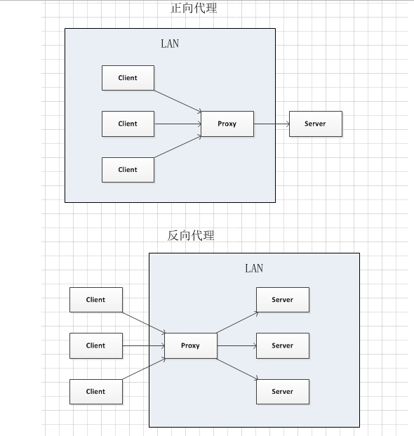

# git 用法  
	git clone URL
	cd XX_Name
	git branch dev
	git checkout dev
	git add .
	git commit -m "备注"
	git push origin dev

___
	git status
	git pull
	git log
	.......指令
___
##Git 补充

###创建分支并使用的步骤：
    1. 在git官网进行新分支的创建（或者也可通过git bash内 使用git brach dev1 命令）  
    2. git pull (将最新代码从git仓库下拿下来 或者也可在空目录下使用git clone url)  
    3. git checkout dev1 (切换到新建的dev1分支，因为pull或者clone下来默认在master主分支上)
    4. npm run start 启动服务器

###每次更改代码后提交的操作：（如：此次更改基于dev1号分支）    
    1. git status  
    2. git add .  
    3. git commit -m "备注"  
    4. git push
    5. git checkout master 切换回主分支master  
    6. git merge dev1 在主分支下合并dev1支


---

# Element UI
	标签的引入
	npm i element-ui -S  

	import ElementUI from 'element-ui'
	import 'element-ui/lib/theme-chalk/index.css'
	Vue.use(ElementUI)
___
# Vue		
###生命周期
创建期间的生命周期函数：  

    1. beforeCreate：实例刚在内存中被创建出来，此时，还没有初始化好 data 和 methods 属性
    2. created：实例已经在内存中创建OK，此时 data 和 methods 已经创建OK，此时还没有开始 编译模板
    3. beforeMount：此时已经完成了模板的编译，但是还没有挂载到页面中
    4. mounted：此时，已经将编译好的模板，挂载到了页面指定的容器中显示运行期间的生命周期函数：
    5. beforeUpdate：状态更新之前执行此函数， 此时 data 中的状态值是最新的，但是界面上显示的 数据还是旧的，因为此时还没有开始重新渲染DOM节点
    6. updated：实例更新完毕之后调用此函数，此时 data 中的状态值 和 界面上显示的数据，都已经完成了更新，界面已经被重新渲染好了！  
        
    销毁期间的生命周期函数：  
    
    7. beforeDestroy：实例销毁之前调用。在这一步，实例仍然完全可用。
    8. destroyed：Vue 实例销毁后调用。调用后，Vue 实例指示的所有东西都会解绑定，所有的事件监听器会被移除，所有的子实例也会被销毁。

### Vue cli2 脚手架的生成  
	npm install -g vue-cli  
    vue init webpack project  
___

### Vue cli2 两处修改
    1. config/index.js  
        build:assetsPublicPath: '/' ----> build:assetsPublicPath: './'  
    2.（npm run build 遇到版本错误） node_modules semver test--->return true
___
### Vue router 基础学习 --基于cli
* 基础   
	>两个标签的使用  
	>router-link  
	>router-view

* 起步  
	>
* 动态路由匹配  
```html
<!--    <router-link to="/p1/page11">Go to Page11</router-link>-->
<!--    <router-link to="/p1/page12">Go to Page12</router-link>-->
    <router-link :to="{name:'page11'}">Go to Page11</router-link>
    <router-link :to="{name:'page12'}">Go to Page12</router-link>
```
* 嵌套路由  

```
 {
  path: '/p2',
  name: 'p2',
  component: page2,
  children: [
    {
      // 当 /user/:id/profile 匹配成功，
      // UserProfile 会被渲染在 User 的 <router-view> 中
      path: 'page21',
      name: 'page21',
      component: page21
    },
    {
      // 当 /user/:id/posts 匹配成功
      // UserPosts 会被渲染在 User 的 <router-view> 中
      path: 'page22',
      name: 'page22',
      component: page22
    }
  ]
}
```
* 编程式的导航  
```html
// this.$router.push({path: subroute})
   this.$router.push({name: subroute})
```
* 命名路由  
    >见上 通过name属性进行路由跳转

### vue-cli中配置sass
##### 1.安装对应依赖node模块：
    >npm install node-sass --save-dev  
        npm install sass-loader --save-dev  
##### 2.打开webpack.base.config.js在loaders里面加上
```
{
     test: /\.scss$/,
     loaders: ["style", "css", "sass"]
},
```
##### 3.在用scss的地方写上
`<style lang="scss" scoped="" type="text/css"></style>`

### Vue 冒号与不加冒号
>加冒号的，说明后面的是一个变量或者表达式；  
没加冒号的后面就是对应的字符串字面量！

### 事件修饰符：
    .stop 阻止冒泡  
    .prevent 阻止默认事件  
    .capture 添加事件侦听器时使用事件捕获模式  
    .self 只当事件在该元素本身（比如不是子元素）触发时触发回调  
    .once 事件只触发一次    
    
###  v-for 和 key 属性
1. 迭代数组
    ```html
    <ul>
        <li v-for="(item, i) in list">索引：{{i}} --- 姓名：{{item.name}} --- 年龄：{{item.age}}
        </li>
    </ul>
    ``` 
2. 迭代对象中的属性
    ```html
    <!-- 循环遍历对象身上的属性 -->
    <div v-for="(val, key, i) in userInfo">{{val}} --- {{key}} --- {{i}}</div>
    ```
3. 迭代数字
    ```html
    <p v-for="i in 10">这是第 {{i}} 个P标签</p>
    ```
为了给 Vue 一个提示，以便它能跟踪每个节点的身份，从而重用和重新排序现有元素，你需要为每项提供一个唯  
    一 key 属性。
    
    
### watch 、 computed 和 methods 之间的对比
    1.  computed 属性的结果会被缓存，除非依赖的响应式属性变化才会重新计算。主要当作属性来使用；
    2.  methods 方法表示一个具体的操作，主要书写业务逻辑；
    3.  watch 一个对象，键是需要观察的表达式，值是对应回调函数。主要用来监听某些特定数据的变化，从而进行某些具体的业务逻辑操作；可以看作是 computed 和 methods 的结合体；    
___
### web前端开发技术规范
1. HTML

2. CSS

3. JS

___
# SASS
    Sass 是成熟、稳定、强大的 CSS 扩展语言。  
    This helps avoid repetition of parent selectors, and makes complex CSS layouts with lots of nested selectors much simpler. 
#### 1.变量
>SASS通过$符号去声明一个变量
#### 2.嵌套
>SASS允许开发人员以嵌套的方式使用CSS，但是过度的使用嵌套会让产生的CSS难以维护，因此是一种不好的实践  
#### 3.引入
>CSS原生的@import会通过额外的HTTP请求获取引入的样式片段.  
而SASS的@import则会直接将这些引入的片段合并至当前CSS文件，并且不会产生新的HTTP请求。
#### 4.混合
>混合（Mixin）用来分组那些需要在页面中复用的CSS声明，开发人员可以通过向Mixin传递变量参数来让代码更加灵活，该特性在添加浏览器兼容性前缀的时候非常有用，SASS目前使用@mixin name指令来进行混合操作。  
```html
@mixin border-radius($radius) {
          border-radius: $radius;
      -ms-border-radius: $radius;
     -moz-border-radius: $radius;
  -webkit-border-radius: $radius;
}

.box {
  @include border-radius(10px);
}
```
>上面的代码建立了一个名为border-radius的Mixin，并传递了一个变量$radius作为参数，然后在后续代码中通过@include border-radius(10px)使用该Mixin，最终编译的结果如下：  
```
.box {
  border-radius: 10px;
  -ms-border-radius: 10px;
  -moz-border-radius: 10px;
  -webkit-border-radius: 10px; }
  ```
#### 5.继承
```html
// 下面代码会正常输出到生成的CSS文件，因为它被其接下来的代码所继承。
%message-common {
  border: 1px solid #ccc;
  padding: 10px;
  color: #333;
}

.message {
  @extend %message-common;
}

.success {
  @extend %message-common;
  border-color: green;
}
```
#### 6.操作符
SASS提供了标准的算术运算符，例如+、-、*、/、%  

#### 7.引用父级选择器"&"
>无论CSS规则嵌套的深度怎样，关键字"&"都会使用父级选择器级联替换全部其出现的位置：
```
/*===== SCSS =====*/
#main {
  color: black;
  a {
    font-weight: bold;
    &:hover { color: red; }
  }
}

/*===== CSS =====*/
#main {
  color: black; }
  #main a {
    font-weight: bold; }
    #main a:hover {
      color: red; }
```
#### 8.嵌套属性
>CSS许多属性都位于相同的命名空间（例如font-family、font-size、font-weight都位于font命名空间下），Scss当中只需要编写命名空间一次，后续嵌套的子属性都将会位于该命名空间之下，请看下面的代码：
```html
/*===== SCSS =====*/
.demo {
  // 命令空间后带有冒号:
  font: {
    family: fantasy;
    size: 30em;
    weight: bold;
  }
}

/*===== CSS =====*/
.demo {
  font-family: fantasy;
  font-size: 30em;
  font-weight: bold; }
```  
___
# CSS3  background-size : cover与contain的区别s
    background-size中的cover与contain都是将图片以相同的宽高比缩放以适应容易的宽高。  
    不同的是`cover`会缩放至图片能够铺满整个容器，可能会有部分图片区域被裁剪。  
    `contain`则是图片会缩放至整个图片都能显示完全，但是容易可能会有留白。


___

#学习笔记：
1. 组件中如果对window绑定事件，在deactive或者unmounted中要对事件进行解绑，否则会影响其他页面。

2. 组件A中嵌套使用组件A的使用方法（递归组件）：不用再次import组件，通过name属性进行调用。
3. keepalive 缓存 可以除去其中的某个跳转 （exclude）
    ```
    <keep-alive exclude="Detail">
          <router-view/>
        </keep-alive>
    ```
4. router index.js  
    ```
    scrollBehavior (to, from, savedPosition) {
        return { x: 0, y: 0 }
      }
    ```
    页面切换时始终回到top最顶部   
5. 动画渐变插件  
     >使用slot放入内容
    ```
    <template>
      <transition>
        <slot></slot>
      </transition>
    </template>
    
    <script>
    export default {
      name: 'FadeAnimation'
    }
    </script>
    
    <style lang="stylus" scoped>
      .v-enter, .v-leave-to
        opacity: 0
      .v-enter-active, .v-leave-active
        transition: opacity .5s
    </style>
    
    ```

6. 阻止事件默认行为，.prevent .stop ....
  
7. 异步组件加载  
    router.js中修改/或者加载正常vue组件时也可使用这种方法将同步请求改成异步请求
      
        >同步加载：    --->一次性加载所有组件
    ```
    import Home from '@/pages/home/Home'  
    
    component: Home
    ```    
        >异步加载：(better) 按需加载--->用到什么组件，才加载什么组件  -->但是每次都会发起一次http请求
    ```
    component: ()=>import('@/pages/home/Home')
    ```
    是否使用同步or异步，需要看情况而定，当项目很庞大，app.js很大时，使用异步加载。其他情况，同步加载即可。  
8. Better-scroll插件   
9. fastclick 插件  （移动端插件）
10. vue-awesome-swiper插件  swiper插件 （轮播插件）
11. iconfont的使用方法  （字体图标）

---

#Webpack 前端工程化
1. 模块化  注意暴露与引用模块的方法
>服务器端：commonjs  同步执行  
浏览器端：  
    AMD（RequireJS） 提前执行  
    CMD（SeaJS）懒执行  
    UMD 通用解决方案  判断上述集中模块化方法是否支持  
    ESModule  
    
Webpack 支持的模块化方法
  >AMD  
    commonjs  
    ESModule(推荐～)
---    
# Flex布局
注意，设为 Flex 布局以后，子元素的`float`、`clear`和`vertical-align`属性将失效。  
   

容器默认存在两根轴：水平的主轴（main axis）和垂直的交叉轴（cross axis）。主轴的开始位置（与边框的交叉点）叫做main start，结束位置叫做main end；交叉轴的开始位置叫做cross start，结束位置叫做cross end。

项目默认沿主轴排列。单个项目占据的主轴空间叫做main size，占据的交叉轴空间叫做cross size。
   
## 三、容器的属性  (紫色大盒子) *

以下6个属性设置在容器上。

> - flex-direction  √
> - flex-wrap  √
> - flex-flow
> - justify-content  √
> - align-items √
> - align-content

### 3.1 flex-direction属性 **

`flex-direction`属性决定主轴的方向（即项目的排列方向）。

> ```
> .box {
>   flex-direction: row | row-reverse | column | column-reverse;
> }
> ```


它可能有4个值。

> - `row`（默认值）：主轴为水平方向，起点在左端。
> - `row-reverse`：主轴为水平方向，起点在右端。
> - `column`：主轴为垂直方向，起点在上沿。
> - `column-reverse`：主轴为垂直方向，起点在下沿。

### 3.2 flex-wrap属性 **

默认情况下，项目都排在一条线（又称"轴线"）上。`flex-wrap`属性定义，如果一条轴线排不下，如何换行。

> ```
> .box{
>   flex-wrap: nowrap | wrap | wrap-reverse;
> }
> ```

它可能取三个值。

（1）`nowrap`（默认）：不换行。压缩~


（2）`wrap`：换行，第一行在上方。


（3）`wrap-reverse`：换行，第一行在下方。


### 3.3 flex-flow

`flex-flow`属性是`flex-direction`属性和`flex-wrap`属性的简写形式，默认值为`row nowrap`。

> ```
> .box {
>   flex-flow: <flex-direction> || <flex-wrap>;
> }
>
> ```

### 3.4 justify-content属性  **

`justify-content`属性定义了项目在主轴上的对齐方式。

> ```
> .box {
>   justify-content: flex-start | flex-end | center | space-between | space-around;
> }
> ```


它可能取5个值，具体对齐方式与轴的方向有关。下面假设主轴为从左到右。

> - `flex-start`（默认值）：左对齐
> - `flex-end`：右对齐
> - `center`： 居中
> - `space-between`：两端对齐，项目之间的间隔都相等。
> - `space-around`：每个项目两侧的间隔相等。所以，项目之间的间隔比项目与边框的间隔大一倍。

### 3.5 align-items属性 **

`align-items`属性定义项目在交叉轴上如何对齐。

> ```
> .box {
>   align-items: flex-start | flex-end | center | baseline | stretch;
> }
> ```


它可能取5个值。具体的对齐方式与交叉轴的方向有关，下面假设交叉轴从上到下。

> - `flex-start`：交叉轴的起点对齐。
> - `flex-end`：交叉轴的终点对齐。
> - `center`：交叉轴的中点对齐。
> - `baseline`: 项目的第一行文字的基线对齐。
> - `stretch`（默认值）：如果项目未设置高度或设为auto，将占满整个容器的高度。

### 3.6 align-content属性

`align-content`属性定义了多根轴线的对齐方式。如果项目只有一根轴线，该属性不起作用。

> ```
> .box {
>   align-content: flex-start | flex-end | center | space-between | space-around | stretch;
> }
>
> ```


该属性可能取6个值。

> - `flex-start`：与交叉轴的起点对齐。
> - `flex-end`：与交叉轴的终点对齐。
> - `center`：与交叉轴的中点对齐。
> - `space-between`：与交叉轴两端对齐，轴线之间的间隔平均分布。
> - `space-around`：每根轴线两侧的间隔都相等。所以，轴线之间的间隔比轴线与边框的间隔大一倍。
> - `stretch`（默认值）：轴线占满整个交叉轴。

## 四、项目的属性  (橙色小盒子) *

以下6个属性设置在项目上。

> - `order`
> - `flex-grow`
> - `flex-shrink`
> - `flex-basis`
> - `flex`
> - `align-self`

### 4.1 order属性

`order`属性定义项目的排列顺序。数值越小，排列越靠前，默认为0。

> ```
> .item {
>   order: <integer>;
> }
> ```


### 4.2 flex-grow属性

`flex-grow`属性定义项目的放大比例，默认为`0`，即如果存在剩余空间，也不放大。

> ```
> .item {
>   flex-grow: <number>; /* default 0 */
> }
>
> ```


如果所有项目的`flex-grow`属性都为1，则它们将等分剩余空间（如果有的话）。如果一个项目的`flex-grow`属性为2，其他项目都为1，则前者占据的剩余空间将比其他项多一倍。

### 4.3 flex-shrink属性

`flex-shrink`属性定义了项目的缩小比例，默认为1，即如果空间不足，该项目将缩小。

> ```
> .item {
>   flex-shrink: <number>; /* default 1 */
> }
>
> ```


如果所有项目的`flex-shrink`属性都为1，当空间不足时，都将等比例缩小。如果一个项目的`flex-shrink`属性为0，其他项目都为1，则空间不足时，前者不缩小。

负值对该属性无效。

### 4.4 flex-basis属性

`flex-basis`属性定义了在分配多余空间之前，项目占据的主轴空间（main size）。浏览器根据这个属性，计算主轴是否有多余空间。它的默认值为`auto`，即项目的本来大小。

> ```
> .item {
>   flex-basis: <length> | auto; /* default auto */
> }
>
> ```

它可以设为跟`width`或`height`属性一样的值（比如350px），则项目将占据固定空间。

### 4.5 flex属性 **

`flex`属性是`flex-grow`, `flex-shrink` 和 `flex-basis`的简写，默认值为`0 1 auto`。后两个属性可选。

> ```
> .item {
>   flex: none | [ <'flex-grow'> <'flex-shrink'>? || <'flex-basis'> ]
> }
> ```

该属性有两个快捷值：`auto` (`1 1 auto`) 和 none (`0 0 auto`)。

建议优先使用这个属性，而不是单独写三个分离的属性，因为浏览器会推算相关值。

### 4.6 align-self属性

`align-self`属性允许单个项目有与其他项目不一样的对齐方式，可覆盖`align-items`属性。默认值为`auto`，表示继承父元素的`align-items`属性，如果没有父元素，则等同于`stretch`。

> ```
> .item {
>   align-self: auto | flex-start | flex-end | center | baseline | stretch;
> }
> ```


该属性可能取6个值，除了auto，其他都与align-items属性完全一致。   
   
   
---
# JS  ES6 学习

#### let
    所声明的变量，只在let命令所在的代码块内有效  
    不存在变量提升  
    暂时性死区
>只要块级作用域内存在let命令，它所声明的变量就“绑定”（binding）这个区域，不再受外部的影响。  
不允许重复声明
#### const
    const声明一个只读的常量。一旦声明，常量的值就不能改变。
    声明时就要定义该常量的值  
    也是块级作用域  
#### Promise

####proxy

####Generator

####Async await
async函数完全可以看作多个异步操作，包装成的一个 Promise 对象，而await命令就是内部then命令的语法糖。  
async函数返回一个 Promise 对象，可以使用then方法添加回调函数。当函数执行的时候，一旦遇到await就会先返回，等到异步操作完成，再接着执行函数体内后面的语句。
#### Class 以及Class继承   
 
---
##Array数组常用方法
先创建一个数组var abc = [1,2,3,4,5,6,7,8,9];

(1) pop(); 这个方法会删除数组的最后一项并返回删除掉的值。 (改变原数组)

>比如：console.log(abc.pop());//9;    console.log(abc); //[1,2,3,4,5,6,7,8];

(2) push(); 这个方法会往数组的最后面添加一个值并返回添加的值。 (改变原数组)

>比如：console.log(abc.push(10));//10;    console.log(abc); //[1,2,3,4,5,6,7,8,9,10];

(3) shift(); 这个方法会删除数组的第一项并返回删除掉的值。 (改变原数组)

>比如：console.log(abc.shift());//1;    console.log(abc); //[2,3,4,5,6,7,8,9];

(4) unshift(); 这个方法会在数组的第一项前添加一个值并返回数组的长度。 (改变原数组)

>比如：console.log(abc.unshift(0));//10;    console.log(abc); //[0,1,2,3,4,5,6,7,8,9];

(5) reverse(); 反转数组顺序。 (改变原数组)

>比如:abc.reverse(); console.log(abc); // [9,8,7,6,5,4,3,2,1];

(6) sort(); 数组排序，不过是按照字符串的方式来排序。 (改变原数组)

>比如: var abb = [0,1,5,10,15]; abb.sort(); console.log(abb); //[0,1,10,15,5];

(7) concat(); 该方法可以基与当前数组中的所有项创建一个新数组。 (不改变原数组)

>比如:var colors = ["red","blue","yellow"];  var colors2 = colors.concat("black","orange");  //["red", "blue", "yellow", "black", "orange"];

(8) slice();该方法可以理解为截取数组，接受2个参数,只填一个参数代表从该位置截取到最后，填两个参数代表要截取的头和尾的位置，但是取头不取尾。(不改变原数组)

>比如：var colors = ["red", "blue", "yellow", "black", "orange"];

>colors.slice(1);//["blue", "yellow", "black", "orange"];

>colors.slice(1,3);//["blue", "yellow"];

(9) splice(); splice是数组当中最强大的方法了，其用法用很多。(改变原数组)

>删除：可以删除任意数量的项，只需要指定2个参数。例如splice(0,2);会删除数组中的前面两项。  

>插入：可以向指定的位置插入任意数量的项，比如：splice(2,0,"red”,"blue”)会从数组的第二个位置开始添加red和blue两项。

>替换：可以删除指定的位置的项并插入任意数量的项，比如：splice(2,2,"red”,"blue”)会从数组的第二个位置删除两项并添加red和blue两项。

>splice()始终返回一个数组，该数组从原始数组中删除的项，没有的话就返回空数组。

(10) indexOf(); 该方法用来检索某项数组出现的位置,出现多次的话只记录第一次出现的位置。(X)

>比如：var abc = [1,2,3,4,5,6,7,8,9];  abc.indexOf(5);  //4;

>注：如果没有检索到值的话会返回-1;

>比如：var abc = [1,2,3,4,5,6,7,8,9];  abc.indexOf(-10);  //-1;

(11) join();将数组转化为字符串，括号内标识连接的方式。(X)

>比如：var abc = ["red","blue","green","yellow"];  abc.join("+");  //"red+blue+green+yellow";

####Js 数组——filter()、map()、some()、every()、forEach()、lastIndexOf()、indexOf()  
##### 1. filter():  筛选出数组中符合条件的项，组成新数组
##### 2. map(): 让数组通过某种计算产生一个新数组
##### 3. some(): 检测数组中是否有某些项符合条件，只要满足一个即返回true
##### 4. every(): 检测数组中的每一项是否符合条件，全部满足才返回true
##### 5. forEach(): 让数组中的每一项做一件事
##### 6. lastIndexOf(): lastIndexOf是从后向前查找某个字符串在数组里最后出现的哪一个的位置
##### 7. indexOf(): indexOf是从前向后查，找到数组下标
##### 8. reduce(): 让数组中的前项和后项做某种计算，并累计最终值
---
##String字符串常用方法
首先创一个字符串 var abc = “helloworld”;

(1) charAt();该方法会返回对应位置所在的字符。（X）

>比如：console.log(abc.charAt(1));  //e

(2) concat(); 拼接字符串;  (不改变原字符串)

>比如 var a = "hello"; a.concat("world");  // helloworld;

(3) slice(); 截取字符串;接受2个参数,只填一个参数代表从该位置截取到最后，填两个参数代表要截取的头和尾的位置，0是第一位，但是取头不取尾。(不改变原字符串)

(4) substring(); 截取字符串;接受2个参数,只填一个参数代表从该位置截取到最后，填两个参数代表要截取的头和尾的位置，但是取头不取尾。 (不改变原字符串)

>注：slice和substring的区别在于他们的参数为负数的时候，slice会把负数与字符串的长度相加，而substring会把负数转化为0。

>比如 var a = "hello"; a.slice(-3) = a.slice(2);  //llo;  

>var a = "hello"; a.substring(-3) = a.substring(0);  //hello;

(5) substr(); 截取字符串;接受2个参数,只填一个参数代表从该位置截取到最后，填两个参数代表要截取的开始位置和长度; (不改变原字符串)

>比如 var a = “helloworld”； a.substr(3,7);  //代表截取字符串第三个位置开始截取7个字符串，故返回"loworld";

(6) indexOf(); 该方法用来检索某个字符出现的位置。（X）

(7) toLocaleUpperCase(); 字符串转大写。(不改变原字符串)

(8) toLocaleLowerCase(); 字符串转小写。(不改变原字符串)

(9) split(); 切割字符串并放在一个数组中,括号内表示切割的标识。(X)

>比如: var abc = "red,blue,green,yellow";  abc.split(",");  // ["red","blue","green","yellow"];


# JS高级
#### JavaScript 的组成

| 组成部分       | 说明                |
| ---------- | ----------------- |
| Ecmascript | 描述了该语言的语法和基本对象    |
| DOM        | 描述了处理网页内容的方法和接口   |
| BOM        | 描述了与浏览器进行交互的方法和接口 |  


#### 基本类型（值类型）

- Undefined
- Null
- Boolean
- Number
- String

#### 复杂类型（引用类型）

- Object
- Array
- Date
- RegExp
- Function
- 基本包装类型
  + Boolean
  + Number
  + String
- 单体内置对象
  + Global
  + Math

#### 类型检测

- `typeof`
- `instanceof`
- `Object.prototype.toString.call()`  

## 继承  
### 构造函数的属性继承：借用构造函数

```javascript
function Person (name, age) {
  this.type = 'human'
  this.name = name
  this.age = age
}

function Student (name, age) {
  // 借用构造函数继承属性成员
  Person.call(this, name, age)
}

var s1 = Student('张三', 18)
console.log(s1.type, s1.name, s1.age) // => human 张三 18
```

### 构造函数的原型方法继承：拷贝继承（for-in）

```javascript
function Person (name, age) {
  this.type = 'human'
  this.name = name
  this.age = age
}

Person.prototype.sayName = function () {
  console.log('hello ' + this.name)
}

function Student (name, age) {
  Person.call(this, name, age)
}

// 原型对象拷贝继承原型对象成员
for(var key in Person.prototype) {
  Student.prototype[key] = Person.prototype[key]
}

var s1 = Student('张三', 18)

s1.sayName() // => hello 张三
```

### 另一种继承方式：原型继承

```javascript
function Person (name, age) {
  this.type = 'human'
  this.name = name
  this.age = age
}

Person.prototype.sayName = function () {
  console.log('hello ' + this.name)
}

function Student (name, age) {
  Person.call(this, name, age)
}

// 利用原型的特性实现继承
Student.prototype = new Person()

var s1 = Student('张三', 18)

console.log(s1.type) // => human

s1.sayName() // => hello 张三
```

---
### 函数内 `this` 指向的不同场景

函数的调用方式决定了 `this` 指向的不同：

| 调用方式   | 非严格模式   | 备注                |
| ------ | ------- | ----------------- |
| 普通函数调用 | window  | 严格模式下是 undefined  |
| 构造函数调用 | 实例对象    | 原型方法中 this 也是实例对象 |
| 对象方法调用 | 该方法所属对象 | 紧挨着的对象            |
| 事件绑定方法 | 绑定事件对象  |                   |
| 定时器函数  | window  |                   |

___
### null、undefined与NaN
undefined表示"缺少值"
>（1）变量被声明了，但没有赋值时，就等于undefined。  
（2) 调用函数时，应该提供的参数没有提供，该参数等于undefined。  
（3）对象没有赋值的属性，该属性的值为undefined。  
（4）函数没有返回值时，默认返回undefined。  

null
>
NaN
>
___
### typeof、instanceof、Object.prototype.toString
####1.typeof  返回一个变量的基本类型，用来检测值类型的数据类型
>number,boolean,string,object,undefined,function
alert(typeof 1) //number  
alert(typeof "1") //string  
alert(typeof []) //object  
alert(typeof null) //object  
alert(typeof a) //undefined  
alert(typeof false) //boolean

####2.instanceof  返回的是一个布尔值，用来判断对象和函数，不能用来判断字符串和数字等
>var a={};  
 alert(a instanceof Object);  //true  
 var b=[];  
 alert(b instanceof Array);  //true  
 alert("string" instanceof String);  //false  
 alert(new String("string")instanceof String);  //true  
####3、Object.prototype.toString.call() 用来精确判断对象的类型
>alert(Object.prototype.toString.call([])) // "[object Array]"  
 Object.prototype.toString.call({}) //"[object Object]"  
 Object.prototype.toString.call(new Date()) //"[object Date]"  


#网站整理
https://blog.csdn.net/qq_36263601/article/details/78366710  
https://blog.csdn.net/u014607184/article/details/79516528  
http://caibaojian.com/mobile-responsive-example.html  
https://www.jianshu.com/p/118f59150810  
https://www.jianshu.com/p/fe0159f8beb4    
http://www.cnblogs.com/lyzg/p/4877277.html?utm_source=caibaojian.com#_label0  


##接口
##1. GET & POST  
|         | GET   | POST                |
| ------ | ------- | ----------------- |
| 后退按钮/刷新 |无害  | 数据会被重新提交（浏览器应该告知用户数据会被重新提交）。  |
| 书签 | 可收藏为书签    | 不可收藏为书签 |
| 缓存 | 能被缓存 | 不能被缓存            |
| 编码类型 | application/x-www-form-urlencoded  |     application/x-www-form-urlencoded 或 multipart/form-data。为二进制数据使用多重编码。              |
| 历史  | 参数保留在浏览器历史中。  |        参数不会保存在浏览器历史中。           |
| 对数据长度的限制 | 	是的。当发送数据时，GET 方法向 URL 添加数据；URL 的长度是受限制的（URL 的最大长度是 2048 个字符）。 | 无限制            |
| 对数据类型的限制 | 	只允许 ASCII 字符。 | 没有限制。也允许二进制数据。            |
| 安全性 | 与POST相比，GET的安全性较差，因为所发送的数据是 URL 的一部分。 在发送密码或其他敏感信息时绝不要使用 GET ！ | POST 比GET更安全，因为参数不会被保存在浏览器历史或 web 服务器日志中。  |  
 |可见性| 	数据在 URL 中对所有人都是可见的。  | 数据不会显示在 URL 中。 |    
     
## 2. 接口地址：ip + location(uri):     
    >eg. https://ark.boe.com.cn/v1 + '/info-console/info/pageList'

    ip是在prod.env.js(地址解析协议)
    在build打包中用到      
      
```js
// prod.env.js文件
'use strict'
let basehost = JSON.parse(process.env.npm_config_argv)
let apiUrl = ''
if(basehost.original[2]){  // npm run ... 里面的内容
  let host = basehost.original[2].replace('--',"")
  if (host === 'prod') {  // 打包生产环境 前两个是打包过程中 npm run build --prod
    apiUrl = 'https://ark.boe.com.cn/v1'
  } else {   // 打包测试模式 npm run build
    apiUrl = 'https://arktest.boe.com.cn/v1'
  }
}else {   // npm run dev 开发环境测试api
    apiUrl = 'https://arktest.boe.com.cn/v1'
}

module.exports = {
  NODE_ENV: '"production"', //常量
  API_BASEURL: '"' + apiUrl + '"'  // 暴露给接口函数
}

```        
打包环境        
    if=>npm run build  
    =>prod   
    =>test 
    
开发环境      
    else=> npm run dev
             
### package.json文件 devDependencies与dependencies
使用 --save-dev 安装的 插件，被写入到 devDependencies 域里面去  
>devDependencies  里面的插件只用于开发环境，不用于生产环境  
而我们使用的一些构建工具比如glup、webpack这些只是在开发中使用的包，上线以后就和他们没关系了，所以将它写入devDependencies。 

使用 --save 安装的插件，则是被写入到 dependencies 区块里面去。
>dependencies  是需要发布到生产环境的。  
比如我们写一个项目要依赖于jQuery，没有这个包的依赖运行就会报错，这时候就把这个依赖写入dependencies ；
 

### module.exports,exports,export和export default,import与require区别与联系
1. module.exports和exports，require是属于CommonJS模块规范  
2. export和export default，import是属于ES6语法  

# 常见HTTP状态码(1XX、2XX、3XX、4XX、5XX）
##  1XX系列：指定客户端应相应的某些动作，代表请求已被接受，需要继续处理。由于 HTTP/1.0 协议中没有定义任何 1xx 状态码，所以除非在某些试验条件下，服务器禁止向此类客户端发送 1xx 响应。  
##  2XX系列：代表请求已成功被服务器接收、理解、并接受。这系列中最常见的有200、201状态码。  
>200状态码：表示请求已成功，请求所希望的响应头或数据体将随此响应返回  

>201状态码：表示请求成功并且服务器创建了新的资源，且其 URI 已经随Location 头信息返回。假如需要的资源无法及时建立的话，应当返回 '202 Accepted'  

>202状态码：服务器已接受请求，但尚未处理
##  3XX系列：代表需要客户端采取进一步的操作才能完成请求，这些状态码用来重定向，后续的请求地址（重定向目标）在本次响应的 Location 域中指明。这系列中最常见的有301、302状态码。
>301状态码：被请求的资源已永久移动到新位置。服务器返回此响应（对 GET 或 HEAD 请求的响应）时，会自动将请求者转到新位置。

>302状态码：请求的资源临时从不同的URI响应请求，但请求者应继续使用原有位置来进行以后的请求

>304自从上次请求后，请求的网页未修改过。服务器返回此响应时，不会返回网页内容。 如果网页自请求者上次请求后再也没有更改过，您应将服务器配置为返回此响应(称为 If-Modified-Since HTTP 标头)。  

## 4XX系列：表示请求错误。代表了客户端看起来可能发生了错误，妨碍了服务器的处理。常见有：401、404状态码。
>401状态码：请求要求身份验证。 对于需要登录的网页，服务器可能返回此响应。

>403状态码：服务器已经理解请求，但是拒绝执行它。与401响应不同的是，身份验证并不能提供任何帮助，而且这个请求也不应该被重复提交。

>404状态码：请求失败，请求所希望得到的资源未被在服务器上发现。没有信息能够告诉用户这个状况到底是暂时的还是永久的。假如服务器知道情况的话，应当使用410状态码来告知旧资源因为某些内部的配置机制问题，已经永久的不可用，而且没有任何可以跳转的地址。404这个状态码被广泛应用于当服务器不想揭示到底为何请求被拒绝或者没有其他适合的响应可用的情况下。  

##  5xx系列：代表了服务器在处理请求的过程中有错误或者异常状态发生，也有可能是服务器意识到以当前的软硬件资源无法完成对请求的处理。常见有500、503状态码。

>500状态码：服务器遇到了一个未曾预料的状况，导致了它无法完成对请求的处理。一般来说，这个问题都会在服务器的程序码出错时出现。

>503状态码：由于临时的服务器维护或者过载，服务器当前无法处理请求。通常，这个是暂时状态，一段时间会恢复

___
#跨域
###为什么会产生跨域
    为了安全, 提出了同源策略  
####源
    • 源（origin）就是协议、域名和端口号  
        http://www.test.com:8080  
        若地址里面的协议、域名和端口号均相同则属于同源。
    以下是相对于 http://www.a.com/test/index.html 的同源检测  
    • http://www.a.com/dir/page.html ----成功  
    • http://www.child.a.com/test/index.html ----失败，域名不同  
    • https://www.a.com/test/index.html ----失败，协议不同  
    • http://www.a.com:8080/test/index.html ----失败，端口号不同
    
    什么是同源策略？ 
        同源策略是浏览器的一个安全功能，不同源的客户端脚本在没有明确授权的情况下，不能读写对方资源。  
        所以a.com下的js脚本采用ajax读取b.com里面的文件数据是会报错的。

####跨域
    不是同源的脚本不能操作其他源下面的对象。想要操作另一个源下的对象是就需要跨域。

#####解决跨域问题
    一、允许浏览器跨域  
    二、保证协议、域名、端口一致  （同源）
    三、服务层解决、前端解决  
        1、JSONP  
        2、服务层  
        3、Nginx解决  
        4、Vue解决  
##### Nginx解决  
>Nginx同Apache一样都是一种WEB服务器。以统一资源描述符(Uniform Resources Identifier)URI或者统一资源定位符(Uniform Resources Locator)URL作为沟通依据，通过HTTP协议提供各种网络服务。  

>Nginx可以作为反向代理进行负载均衡的实现。

找到config/index.js，在proxyTable中：
```
proxyTable: {
    '/test': {  //使用"/api"来代替"http://f.apiplus.c"
        target: 'https://11.22.33.44.com', //源地址
        source: true, // 如果协议为https，需要为true
        changeOrigin: true, //如果是跨域请求接口，需要配置为true
        pathRewrite: {
            '^/test': '/' //路径重写,如果实际接口中米有test通用前缀，需要重写
            // 如果本身的接口就有’/test’这种通用前缀，就可以把pathRewrite删掉。
        }*/
    }
}

```
>代理  
    此时就涉及到两个角色，一个是被代理角色，一个是目标角色，被代理角色通过这个代理访问目标角色完成一些任务的过程称为代理操作过程；如同生活中的专卖店~客人到adidas专卖店买了一双鞋，这个专卖店就是代理，被代理角色就是adidas厂家，目标角色就是用户。  
    
>正向代理
   
 
在如今的网络环境下，我们如果由于技术需要要去访问国外的某些网站，此时你会发现位于国外的某网站我们通过浏览器是没有办法访问的，此时大家可能都会用一个操作FQ进行访问，FQ的方式主要是找到一个可以访问国外网站的代理服务器，我们将请求发送给代理服务器，代理服务器去访问国外的网站，然后将访问到的数据传递给我们！  
上述这样的代理模式称为正向代理，正向代理最大的特点是客户端非常明确要访问的服务器地址；服务器只清楚请求来自哪个代理服务器，而不清楚来自哪个具体的客户端；正向代理模式屏蔽或者隐藏了真实客户端信息。  
正向代理，"它代理的是客户端，代客户端发出请求"  

>反向代理   


多个客户端给服务器发送的请求，Nginx服务器接收到之后，按照一定的规则分发给了后端的业务处理服务器进行处理了。此时~请求的来源也就是客户端是明确的，但是请求具体由哪台服务器处理的并不明确了，Nginx扮演的就是一个反向代理角色。  

客户端是无感知代理的存在的，反向代理对外都是透明的，访问者并不知道自己访问的是一个代理。因为客户端不需要任何配置就可以访问。  

反向代理，"它代理的是服务端，代服务端接收请求"，主要用于服务器集群分布式部署的情况下，反向代理隐藏了服务器的信息。

反向代理的作用： 
（1）保证内网的安全，通常将反向代理作为公网访问地址，Web服务器是内网  
（2）负载均衡，通过反向代理服务器来优化网站的负载  

总结：  

>在正向代理中，Proxy和Client同属于一个LAN（图中方框内），隐藏了客户端信息；  

>在反向代理中，Proxy和Server同属于一个LAN（图中方框内），隐藏了服务端信息；  

>实际上，Proxy在两种代理中做的事情都是替服务器代为收发请求和响应，不过从结构上看正好左右互换了一下，所以把后出现的那种代理方式称为反向代理了。  

#Vux
安装：
build/webpack.base.conf.js 文件中
```
const vuxLoader = require('vux-loader')
const webpackConfig = originalConfig // 原来的 module.exports 代码赋值给变量 webpackConfig

module.exports = vuxLoader.merge(webpackConfig, {
  plugins: ['vux-ui']
})
```
Vux 的使用举例
